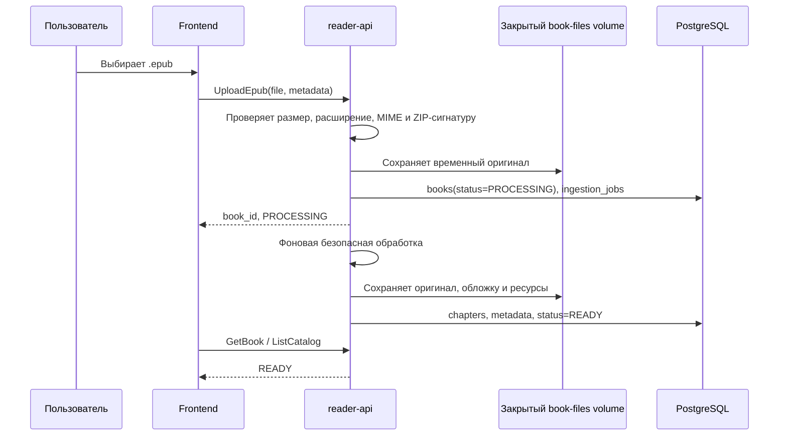

# Загрузка, хранение и выдача EPUB-книг и страниц

## Термины и границы

Под «страницей» здесь понимается видимый фрагмент EPUB, который формирует
ридер. У EPUB нет стабильных серверных страниц: одна и та же глава занимает
разное число экранов при другом размере шрифта или ширине устройства. Поэтому
backend хранит **главы** и EPUB CFI-якоря, а страницу вычисляет frontend.

Книги находятся в общем семейном каталоге. Сама книга доступна всем
аутентифицированным членам семьи, но связь с личной библиотекой, прогресс и
настройки остаются индивидуальными.

## Жизненный цикл файла



1. Frontend разрешает выбрать только файл `.epub`, до начала передачи проверяет
   локальный размер и показывает его пользователю.
2. `UploadEpub` передаёт файл в `reader-api`. Максимальный размер первоначально
   ограничивается 50 MiB; лимит является настройкой сервера, а не константой UI.
   Если gRPC-Web streaming окажется ненадёжным для браузера, тот же сервис
   выдаёт короткоживущий одноразовый HTTP upload URL. Файл всё равно получает
   `reader-api`, а не публичное хранилище.
3. Сервер повторно проверяет расширение, MIME, ZIP magic bytes, лимит размера и
   допустимый коэффициент распаковки. Это защищает от подмены типа и zip bomb.
4. Оригинал сначала записывается во временный каталог, например
   `tmp/<upload-id>.epub`. После успешной проверки он атомарно перемещается в
   `books/<book-id>/original.epub` на закрытом persistent volume.
5. В одной транзакции PostgreSQL создаются общая запись `books` со статусом
   `PROCESSING` и `ingestion_jobs`. Клиент видит новую книгу в общем каталоге,
   но открыть её до `READY` не может.
6. Фоновая задача в том же Go-приложении разбирает EPUB. Если процесс
   перезапущен, записи `PROCESSING` подхватываются снова; задача должна быть
   идемпотентна.
7. При успехе книга становится `READY`; при ошибке — `FAILED` с безопасным для
   показа кодом ошибки. Исходный EPUB сохраняется для повторной обработки;
   частично созданные файлы удаляются или не становятся доступными.

## Что и где хранится

```text
book-files/                         # Docker persistent volume, не web-root
  books/<book-id>/
    original.epub                   # загруженный неизменённый файл
    cover.<ext>                     # извлечённая безопасная обложка
    resources/<sha256>.<ext>        # изображения/шрифты после allow-list проверки
  tmp/                              # временные upload/распаковка; очищается по TTL

PostgreSQL reader:
  books                             # общий каталог, статус, пути, checksum, metadata
  book_chapters                     # chapter spine, CFI, sanitized XHTML, plain text
  ingestion_jobs                    # повторяемая обработка
  user_books                        # личное добавление книги
  reading_progress                  # CFI последней позиции пользователя
```

Оригинал и бинарные ресурсы хранятся в файловом volume, а не в `bytea`
PostgreSQL: это упрощает резервные копии и не раздувает транзакционную БД.
Текст главы (`sanitized_html` и `plain_text`) хранится в `book_chapters`,
поскольку он нужен для быстрого чтения, поиска предложения и подсветки слов.

Каждый файл получает SHA-256. Для одинакового EPUB можно использовать
`content_sha256 UNIQUE`, чтобы не хранить второй оригинал: повторная загрузка
возвращает существующий `book_id` и не запускает обработку заново. Решение о
такой дедупликации должно быть отражено в UI: книга уже находится в общем
каталоге, но всё ещё может быть добавлена в личную библиотеку.

## Безопасная обработка EPUB

EPUB — ZIP-контейнер с XHTML и ресурсами, поэтому его содержимое недоверенное.
Воркер обязан:

- принимать только корректный ZIP с обязательным EPUB mimetype/manifest;
- лимитировать количество файлов, глубину путей, размер распаковки и время
  обработки;
- запрещать path traversal (`..`, абсолютные пути, symbolic links);
- разрешать только нужные MIME типов ресурсов (изображения, ограниченный набор
  шрифтов и CSS);
- санитизировать XHTML: удалить `script`, event handlers, iframe, forms,
  опасные URL/CSS и сетевые обращения;
- переписать ссылки на разрешённые ресурсы в идентификаторы данного `book_id`;
- сформировать chapter spine и CFI-якоря, не полагаясь на номера страниц.

Обработчик не исполняет код из EPUB и не распаковывает файл в директорию,
доступную frontend. Если понадобится антивирусная проверка, её добавляют между
временным сохранением и разбором без изменения gRPC API.

## Выдача книги, глав и ресурсов

### Каталог и личная библиотека

- `ListCatalog` выдаёт всем аутентифицированным семейным аккаунтам метаданные
  общих книг и их статусы, без байтов EPUB.
- `ListMyBooks` выдаёт только строки `user_books` текущего пользователя вместе
  с метаданными книги.
- `AddToMyLibrary` создаёт связь пользователь–книга идемпотентно.
- Первое чтение вызывает то же добавление с причиной `first_read`; удаление из
  личной библиотеки удаляет лишь эту связь, но не общий EPUB.

### Открытие и «страницы» ридера

1. Frontend вызывает `GetReadingState(book_id)`. Backend проверяет, что книга
   `READY`, идемпотентно добавляет её в `user_books` и возвращает последний CFI
   либо начало первой главы.
2. Frontend вызывает `GetChapter(book_id, chapter_id_or_href)`. В ответе —
   санитизированный XHTML главы, последовательность/CFI-границы и ссылки на
   разрешённые ресурсы, а не исходный ZIP.
3. EPUB.js формирует на устройстве экранные страницы в соответствии с размером
   шрифта и viewport. При перелистывании он возвращает CFI; frontend передаёт
   его через `SaveReadingProgress` с debounce и перед уходом со страницы.
4. При переходе за границу главы frontend запрашивает следующую/предыдущую
   главу. В памяти держатся текущая и соседние главы; остальное освобождается.

Такой API не передаёт всю книгу при каждом открытии и не привязывает позицию к
пикселям или номеру страницы. Изменение шрифта не ломает `epub_cfi`.

### Ресурсы главы

Изображения и разрешённые шрифты выдаются либо через короткоживущий
подписанный URL `reader-api`, либо через тот же Envoy маршрут
`/book-resources/<book-id>/<resource-id>`. В обоих случаях Go проверяет JWT и
существование книги в общем каталоге. Нельзя делать volume статической папкой
Nginx/Envoy: иначе обходится проверка аутентификации.

Для resource endpoint применяются `Content-Type`, `X-Content-Type-Options:
nosniff`, ограниченный `Content-Security-Policy` и immutable cache-control для
файлов по SHA-256. XHTML-главы возвращаются только gRPC API и рендерятся в
изолированном контейнере frontend.

## Сбои, удаление и резервные копии

- Ошибка загрузки или проверки удаляет временный файл; она не создаёт видимую
  книгу. Ошибка обработки оставляет диагностическую запись и статус `FAILED`.
- Повторный запрос с одним `idempotency_key` не создаёт дубликаты книги или job.
- Удаление из личной библиотеки не удаляет общую книгу и личный словарь.
  Удаление общей книги — отдельная административная операция владельца сервера;
  перед ней проверяются другие связи `user_books` и прогресс.
- Nightly backup включает согласованные дамп PostgreSQL и снимок `book-files`.
  Восстановление всегда выполняется обоих частей одной даты, иначе записи книг
  могут ссылаться на отсутствующие EPUB.
- В access-логах не пишутся текст главы, предложение для перевода, JWT и пути
  файлов на хосте; достаточно `book_id`, статуса и технического кода ошибки.
