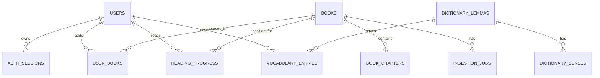

# Данные и схема PostgreSQL

## Граница хранилищ

У приложения одна PostgreSQL БД `reader` и один закрытый файловый volume для
оригинальных EPUB, обложек и санитизированных ресурсов. Redis, S3/MinIO и
отдельная очередь в домашней версии не используются. Внешний LibreTranslate не
получает БД приложения.

## Аккаунты

| Таблица | Основные поля и ограничения |
| --- | --- |
| `users` | `id uuid PK`, `email citext UNIQUE NOT NULL`, `password_hash`, timestamps, `deleted_at`. У каждого члена семьи отдельная запись. |
| `auth_sessions` | `id uuid PK`, `user_id FK`, `refresh_token_hash UNIQUE`, `expires_at`, `revoked_at`, `device_label`; индекс `(user_id, expires_at)`. |

## Библиотека EPUB

| Таблица | Основные поля и ограничения |
| --- | --- |
| `books` | `id uuid PK`, `uploaded_by_user_id FK`, `title`, `author`, `format` со строгим `CHECK format = 'epub'`, `status`, `source_file_path UNIQUE`, `cover_file_path`, `failure_code`, timestamps; это общий семейный каталог, индекс `(status, created_at DESC)`. |
| `book_chapters` | `id uuid PK`, `book_id FK`, `sequence int`, `href`, `start_cfi`, `end_cfi`, `sanitized_html`, `plain_text`, `word_count`; `UNIQUE(book_id, sequence)`. |
| `ingestion_jobs` | `id uuid PK`, `book_id FK UNIQUE`, `state`, `attempt`, `locked_at`, `finished_at`, `error_detail`; индекс по незавершённым state. |
| `user_books` | `user_id FK`, `book_id FK`, `added_at`, `added_via enum(button,first_read)`; `PRIMARY KEY(user_id, book_id)`, индекс `(user_id, added_at DESC)`. Это личная библиотека. |

Оригинальный EPUB не хранится в `bytea`: файл лежит в volume, который попадает
в резервную копию. Перед удалением книги приложение удаляет связанные файлы
только после успешного удаления записи/или помещает их в recovery-папку.

## Ридер

| Таблица | Основные поля и ограничения |
| --- | --- |
| `reading_progress` | `user_id FK`, `book_id FK`, `chapter_id FK nullable`, `epub_cfi NOT NULL`, `progress_percent`, `revision bigint`, `updated_at`; `PRIMARY KEY(user_id, book_id)`, составной FK `(user_id, book_id)` на `user_books`. |
| `user_reader_settings` | `user_id PK/FK`, `font_scale smallint CHECK 80..200`, `theme`, `line_height`, `updated_at`. |

Каталог доступен всем семейным аккаунтам. Составной FK гарантирует, что прогресс
создаётся только для добавленной пользователем книги; use case всё равно
проверяет текущий аккаунт при изменении личной библиотеки и прогресса.

## Словарь и локальный кэш перевода

| Таблица | Основные поля и ограничения |
| --- | --- |
| `dictionary_lemmas` | `id bigserial PK`, `language char(2)`, `lemma citext`, `source`, `source_version`; `UNIQUE(language, lemma, source, source_version)`. |
| `dictionary_senses` | `id bigserial PK`, `lemma_id FK`, `part_of_speech`, `translations jsonb`, `example_en`, `example_ru`, `source_url`, `attribution`, `position`. |
| `vocabulary_entries` | `id uuid PK`, `user_id FK`, `lemma_id FK`, `source_form`, `chosen_sense_id FK nullable`, timestamps, `UNIQUE(user_id, lemma_id)`. |
| `translation_cache` | `key_hash bytea PK`, `model_version`, `source_lang`, `target_lang`, `normalized_text`, `translated_text`, `expires_at`, `created_at`. |

Для домашней нагрузки достаточно btree-индексов `(user_id, created_at DESC)`
и `(user_id, lemma_id)`. Полнотекстовый индекс добавляется только при реальной
потребности. Ни ключей сессий, ни полного текста книг, ни содержимого переводов
в логах не сохраняется.
